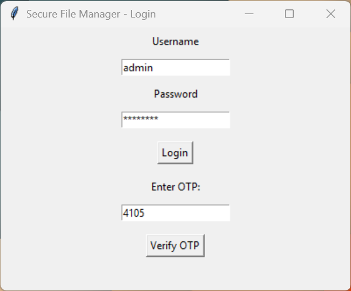
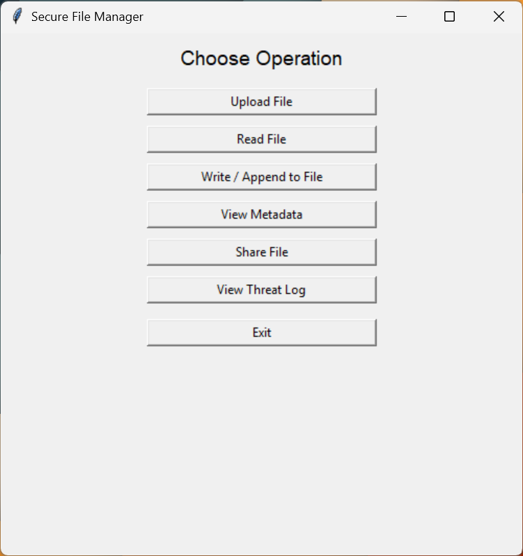
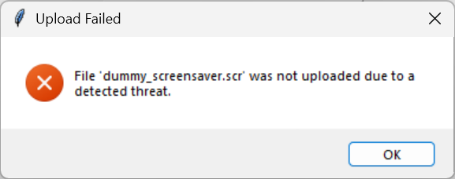
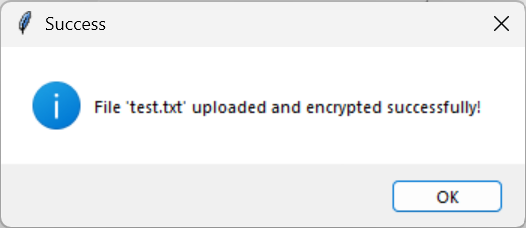
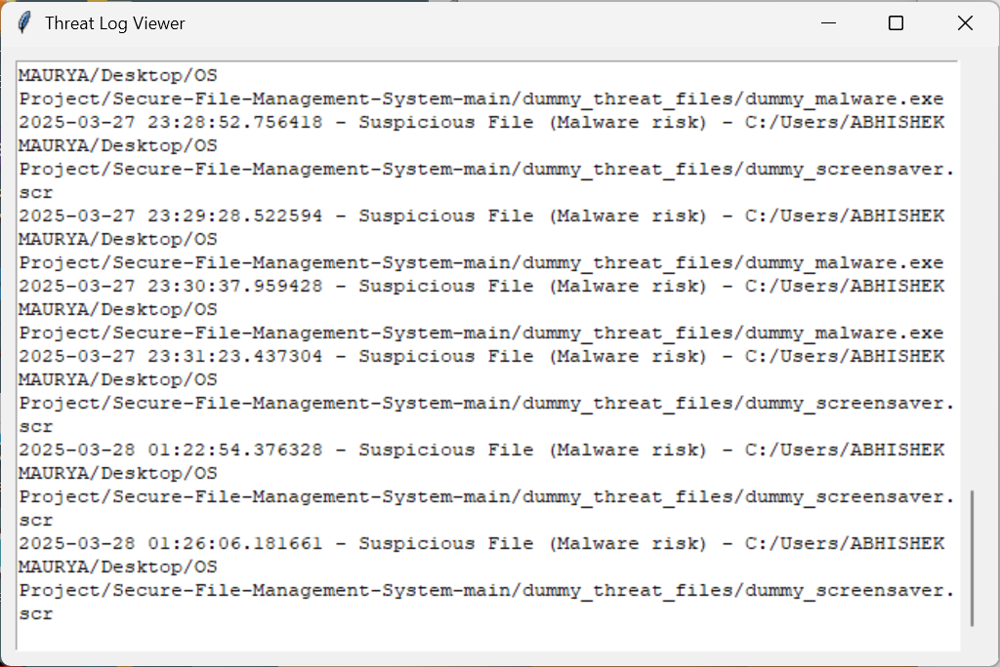

# 🔒 Secure File Manager  

A **GUI-based file management system** with **encryption, threat detection, metadata viewing, and secure file sharing**. Built using `Python` and `Tkinter`.  

## 🚀 Features  
✅ Secure file upload with **malware and overflow detection**  
✅ **File encryption & decryption** for safe storage  
✅ **View file metadata** (size, creation date, last modified)  
✅ **Threat logging** for detected vulnerabilities  
✅ **File sharing** with recipient details  
✅ **Login authentication with OTP verification**  

---

## 🛠 Installation  

1. **Clone the repository**  
   ```sh
   git clone https://github.com/vikas5172/Secure-File-Management-System.git
   cd Secure-File-Management-System
   ```
2. **Install dependencies**  
   ```sh
   pip install -r requirements.txt
   ```
3. **Run the application**  
   ```sh
   python main.py
   ```

---

## 📸 Screenshots  

> **Login Page**  
<p align="center">
    
</p>

> **File Operations Page**  
>   
 
> **Threat Detection**  
>   

> **File Encryption during Upload**  
>   

> **Threat Log Viewer**  
>   

---

## 🔑 Authentication Flow  
1. **User logs in** using default credentials (`admin/admin123`)  
2. **OTP is generated** and must be entered correctly  
3. **Access granted** to the **Secure File Manager GUI**  

---

## 💡 How It Works  
1. **File Upload & Threat Detection**  
   - User selects a file to upload 📁  
   - System **scans for malware** & buffer overflow threats 🔍  
   - If **safe**, file is **encrypted** and stored securely 🔐  

2. **File Decryption**  
   - User selects an **encrypted file**  
   - System **decrypts and displays** the contents  

3. **File Sharing**  
   - User chooses a file 📂  
   - System **encrypts & transfers** to the recipient securely  

---

## ⚠️ Security Notes  
- Do **not share OTPs or credentials** publicly  
- Encrypt files **before sharing** to prevent unauthorized access  
- Regularly check **threat_log.txt** for detected issues  

---

## ✨ Contributors  
👤 **Vikas** - [GitHub](https://github.com/vikas5172)  
👤 **Rahul** - [GitHub](https://github.com/rahulach) 

---

## ⭐ Support  
If you like this project, **star** ⭐ the repo and **contribute**!  
